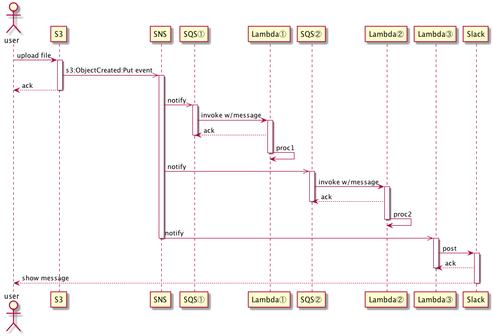

s3-sns-sqs-lambda-slack-go-sample
====

## Description
s3-sns-sqs-lambda-slack-go-sample is a sample implementation of a [*Fanout Pattern* of a cloud design pattern](http://aws.clouddesignpattern.org/index.php/CDP:Fanout%E3%83%91%E3%82%BF%E3%83%BC%E3%83%B3)



## Production

### prerequisites

You have to prepare credentials with proper policies.

And,

* install [aws-cli](https://github.com/aws/aws-cli)
* install [aws-sam-cli](https://github.com/awslabs/aws-sam-cli). Docker is also required. Follow the instruction [here](https://github.com/awslabs/aws-sam-cli#installation).
* install [direnv](https://github.com/direnv/direnv)
* install [saw](https://github.com/TylerBrock/saw)
  * you can watch CloudWatch logs on your terminal
* set environment variables to [.envrc.sample](./.envrc.sample) and remove *.sample*.
  * *WEBHOOK_URL* Incoming Webhook URL of Slack. You can get URL at [this page](https://api.slack.com/incoming-webhooks).
  * *CHANNEL* where the Lambda③'ll post message in Slack
  * *USER_NAME* by whom the message is posted in Slack
  * *ICON* message sender's icon like :piggy:
  * *FILE_BUCKET* S3 bucket where you upload your file. It's *S3* in sequence and hould be unique globally.
  * *STACK_BUCKET* is S3 bucket name for artifacts of SAM and should be unique globally.

### deploy

```
$ dep ensure                       # to resolve dependency
$ aws s3 mb "s3://${STACK_BUCKET}" # for artifacts of SAM
$ make deploy
```

Now, you can check a behavior of this architecture by uploading file to S3.

```
$ saw groups
/aws/lambda/stack-s3-sns-sqs-lambda-slack-go-sa-WriteExtLambda-XXXXXXXXXXXX
/aws/lambda/stack-s3-sns-sqs-lambda-slack-WriteFileNameLambda-XXXXXXXXXXXX
/aws/lambda/stack-s3-sns-sqs-lambda-slack-go-sa-NotifierLambda-XXXXXXXXXXXX

$ saw watch /aws/lambda/stack-s3-sns-sqs-lambda-slack-go-sa-WriteExtLambda-XXXXXXXXXXXX &
$ saw watch /aws/lambda/stack-s3-sns-sqs-lambda-slack-WriteFileNameLambda-XXXXXXXXXXXX &
$ saw watch /aws/lambda/stack-s3-sns-sqs-lambda-slack-go-sa-NotifierLambda-XXXXXXXXXXXX &

# open another window
$ aws s3 cp ./README.md "s3://${FILE_BUCKET}"
```

### delete

In this architecture, Lambdas execute *long polling* to SQS and it's billable. So you should delete your stack by executing the command below after trying deploy.

```
$ make delete
```

## Articles (Japanese)

* [Goで学ぶAWS Lambda（PDF、ePubセット版）](https://toshi0607.booth.pm/items/1034858)
  * This architecture is explained in detail in this book.
* [技術書典5で『Goで学ぶAWS Lambda』を出展します #技術書典](http://toshi0607.com/programming/learning-aws-lambda-with-go/)
* [技術書典5の『Goで学ぶAWS Lambda』の振り返りとフィードバックのお願い #技術書典](http://toshi0607.com/event/review-of-tbf5/)
